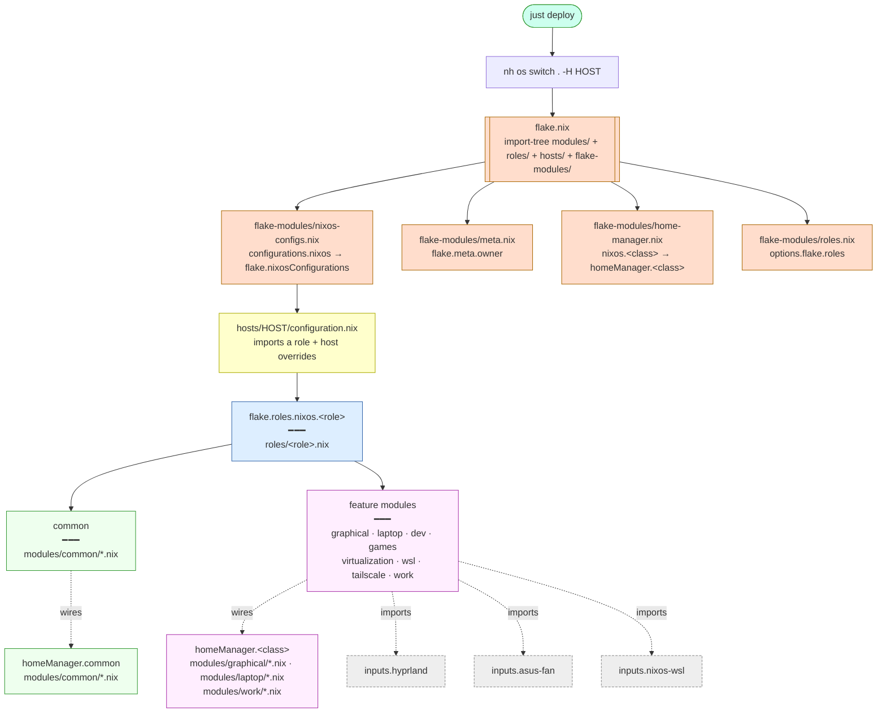

# NixOS Setup

This config uses a layered [dendritic-style](https://github.com/mightyiam/dendritic) pattern: files in a folder merge into one named *module*, *roles* bundle modules together, and *hosts* import one role plus their own hardware.

Four top-level directories, each with one job:

| Dir | Contents | Writes |
|---|---|---|
| `flake-modules/` | framework glue — option declarations, the homeManager↔NixOS bridge | `options.flake.*`, framework-level config |
| `modules/<module>/` | leaf config — files contributing to one module | `flake.modules.{nixos,homeManager}.<module>` |
| `roles/<role>.nix` | role bundles — each picks a list of modules | `flake.roles.nixos.<role>` |
| `hosts/<host>/` | one host's `configuration.nix` + `hardware-configuration.nix` | `configurations.nixos.<host>.module` |

Folder discipline:
- Every `.nix` in `modules/<x>/` only writes `flake.modules.{nixos,homeManager}.<x>`. Folder name == module name.
- Every `.nix` in `roles/` is one role, only writes `flake.roles.nixos.<role>`, body is only `imports = [...]` — no real config in role files.
- Every `.nix` in `hosts/<h>/` only writes `configurations.nixos.<h>.module`. Imports one role plus host-specific overrides.
- Every `.nix` in `flake-modules/` only declares options or wires framework glue. No domain config.

## Repo structure

```
flake.nix                                # entry — inputs + import-tree

flake-modules/                           # framework glue
  meta.nix                               # options.flake.meta + owner constants
  nixos-configs.nix                      # configurations.nixos.<h> → flake.nixosConfigurations
  roles.nix                              # options.flake.roles
  home-manager.nix                       # nixos.<class> ↔ homeManager.<class> bridge

modules/                                 # leaf modules — folder name == module name
  common/                                # → nixos.common + homeManager.common (every host)
  graphical/                             # → nixos.graphical + homeManager.graphical (Wayland DE)
  laptop/                                # → nixos.laptop + homeManager.laptop (laptop hardware)
  dev/                                   # → nixos.dev (docker, nix-ld, dconf)
  games/                                 # → nixos.games (Steam)
  virtualization/                        # → nixos.virtualization (libvirt, kvm)
  work/                                  # → homeManager.work (teleport, vault)
  wsl/                                   # → nixos.wsl (NixOS-WSL boot, x-forwarding)
  tailscale/                             # → nixos.tailscale (tailscaled, firewall)

roles/                                   # role bundles
  laptop.nix                             # → flake.roles.nixos.laptop
  wsl.nix                                # → flake.roles.nixos.wsl

hosts/                                   # one folder per machine
  xen/
    configuration.nix                    # imports flake.roles.nixos.laptop + host specifics
    hardware-configuration.nix           # nixos-generate-config output (filtered out of import-tree)
  Sam-Desktop/
    configuration.nix

config/                                  # static dotfiles symlinked by home-manager
pkgs/                                    # custom callPackage recipes
```

`import-tree` auto-loads every `.nix` under `modules/`, `flake-modules/`, `roles/`, and `hosts/`. Add a file, its contributions are active on the next rebuild. The only filter is on `hardware-configuration.nix` — that's a NixOS module imported explicitly by the host's `configuration.nix`, not a flake-module.

## How it works

### Modules merge by name

Most files don't declare a new module — they contribute to an existing module by name. `modules/graphical/audio.nix` writes `flake.modules.nixos.graphical = { services.pipewire.enable = true; }`; `modules/graphical/bluetooth.nix` writes `flake.modules.nixos.graphical = { hardware.bluetooth.enable = true; }`; flake-parts merges them. Adding a feature = drop a file in the right folder, not edit an imports list.

### Roles bundle modules

A role file is just `imports = [...]` — a list of modules a host wants together:

```nix
# roles/laptop.nix
{ config, ... }: {
  flake.roles.nixos.laptop = {
    imports = with config.flake.modules.nixos; [
      common graphical dev games laptop tailscale virtualization
    ];
  };
}
```

Hosts therefore stay tiny — one role import plus a few host-specific overrides.

`flake.roles.nixos.laptop` (the bundle) and `flake.modules.nixos.laptop` (the form-factor module) live in different attribute paths — no collision, even though they share a name.

### HM is wired into NixOS centrally

`flake-modules/home-manager.nix` declares that every NixOS class pulls its homeManager twin into `home-manager.users.${owner}.imports`:

```nix
flake.modules.nixos.common = {
  imports = [ inputs.home-manager.nixosModules.home-manager ];
  home-manager = {
    useGlobalPkgs = true;
    useUserPackages = true;
    users.${username}.imports = [ config.flake.modules.homeManager.common ];
  };
};
flake.modules.nixos.graphical.home-manager.users.${username}.imports =
  [ config.flake.modules.homeManager.graphical ];
# … etc for laptop, work
```

Hosts therefore list only NixOS classes (via the role they import). Pulling in `nixos.graphical` automatically pulls in `homeManager.graphical` for the owner. There is no "second list" for HM modules in a host file.

### Owner is one value

`flake-modules/meta.nix` is the single source of truth for username, home directory, description, and home-manager state version. Every module that needs the current user references `config.flake.meta.owner.*` instead of hardcoding `"sboynton"`. The home-manager `stateVersion` is stored as `homeManagerStateVersion` to make its scope explicit — system stateVersion is set per-host in `hosts/<h>/configuration.nix`.

## Modules

| Module | Means | Class(es) | Files |
|---|---|---|---|
| `common` | universal foundation — nix, user, locale, openssh, shell, dotfiles, CLI tools | nixos + homeManager | `modules/common/` |
| `graphical` | Wayland DE (hyprland), theming, GUI apps | nixos + homeManager | `modules/graphical/` |
| `laptop` | laptop hardware (asus fan/edid, keyd) | nixos + homeManager | `modules/laptop/` |
| `dev` | dev tooling (docker, nix-ld, dconf) | nixos | `modules/dev/` |
| `games` | Steam | nixos | `modules/games/` |
| `virtualization` | libvirt + kvm | nixos | `modules/virtualization/` |
| `wsl` | running under WSL | nixos | `modules/wsl/` |
| `tailscale` | tailscaled + firewall | nixos | `modules/tailscale/` |
| `work` | teleport, vault | homeManager | `modules/work/` |

## Roles

| Role | Bundles | Used by |
|---|---|---|
| `laptop` | common, graphical, dev, games, laptop, tailscale, virtualization | `xen` |
| `wsl` | common, dev, virtualization, work, wsl | `Sam-Desktop` |

## Composition (hosts)

A host is one `configuration.nix` plus its `hardware-configuration.nix`:

```nix
# hosts/xen/configuration.nix
{ config, ... }:
let
  owner = config.flake.meta.owner.username;
in
{
  configurations.nixos.xen.module = {
    imports = [
      ./hardware-configuration.nix
      config.flake.roles.nixos.laptop
    ];

    networking.hostName = "xen";
    nixpkgs.hostPlatform = "x86_64-linux";
    system.stateVersion = "25.11";

    boot.loader.systemd-boot.enable = true;
    boot.loader.efi.canTouchEfiVariables = true;

    # …per-host overrides (monitor layout, etc.)
  };
}
```

`flake-modules/nixos-configs.nix` walks `config.configurations.nixos` and builds `flake.nixosConfigurations` automatically — **no `flake.nix` edit is needed when adding a host.**

## Build flow



**Reading it:**
- `import-tree` loads every `.nix` under `modules/`, `roles/`, `hosts/`, and `flake-modules/`.
- The host's `configuration.nix` imports one role; the role imports modules; module files merge by name.
- HM content is carried automatically by the matching nixos module via the bridge.
- Feature modules pull their flake inputs only when actually imported — WSL doesn't evaluate hyprland, xen doesn't evaluate nixos-wsl.

## Bootstrap (new machine)

Minimal path from a fresh NixOS install to this flake owning the system. `nh ... -H <hostname>` selects which `nixosConfigurations.<name>` to build; the selected entry's `networking.hostName` sets the running hostname on activation.

1. Install NixOS (minimal or graphical ISO) and log in.
2. Get networking: `nmtui` for wireless, nothing to do for wired.
3. Enable flakes — the only edit you'll make to `/etc/nixos/`:
   ```nix
   # /etc/nixos/configuration.nix
   nix.settings.experimental-features = [ "nix-command" "flakes" ];
   ```
   Then `sudo nixos-rebuild switch` once so system nix understands flakes.
4. Clone the repo:
   ```bash
   nix-shell -p git
   git clone <repo-url> ~/dotfiles && cd ~/dotfiles
   ```
5. Dump hardware config directly from the running hardware (never copy the installer's file or a stale checked-in one — UUIDs and kernel modules drift):
   ```bash
   mkdir -p hosts/<hostname>
   sudo nixos-generate-config --show-hardware-config > hosts/<hostname>/hardware-configuration.nix
   ```
6. Write `hosts/<hostname>/configuration.nix` (see [Adding a host](#adding-a-host)). No `flake.nix` edit is required — `configurations.nixos.<name>` is auto-exposed as `flake.nixosConfigurations.<name>`.
7. If reinstalling over an old install, wipe leftover partitions so systemd GPT auto-discovery doesn't try to mount them and trigger a UUID wait-job:
   ```bash
   lsblk -f                         # find orphans not in fileSystems
   sudo wipefs -a /dev/<partition>  # for each orphan (old swap, old /home, etc.)
   ```
8. Stage all files — flakes only see git-tracked files, unstaged edits are invisible:
   ```bash
   git add -A
   ```
9. Sanity check the flake sees the hardware config:
   ```bash
   nix eval --json .#nixosConfigurations.<hostname>.config.fileSystems
   ```
10. Build as `boot` (not `switch`) and reboot — if the new generation breaks, the previous one is still the default entry and you can roll back from the systemd-boot menu. `nh` isn't on `PATH` yet, so invoke it one-off via `nix run`:
    ```bash
    nix run nixpkgs#nh -- os boot . -H <hostname>
    sudo reboot
    ```
11. After the machine comes up clean on the flake, `nh` is installed via home-manager. From then on:
    ```bash
    nh os switch . -H <hostname>   # or: just deploy
    ```

`/etc/nixos/configuration.nix` is no longer consulted after step 10 activates — the flake owns everything.

## Adding a host

For when the repo is already set up and you want to provision another machine.

1. On the target machine, clone the repo and dump its hardware config:
   ```bash
   git clone <repo-url> ~/dotfiles && cd ~/dotfiles
   mkdir -p hosts/<hostname>
   sudo nixos-generate-config --show-hardware-config > hosts/<hostname>/hardware-configuration.nix
   ```

2. Pick a role from `roles/` (or write a new one — see [Adding a role](#adding-a-role)). Write `hosts/<hostname>/configuration.nix`:

   ```nix
   { config, ... }:
   {
     configurations.nixos.<hostname>.module = {
       imports = [
         ./hardware-configuration.nix
         config.flake.roles.nixos.<role>     # e.g. laptop, wsl
       ];

       networking.hostName = "<hostname>";
       nixpkgs.hostPlatform = "x86_64-linux";
       system.stateVersion = "25.11";

       boot.loader.systemd-boot.enable = true;
       boot.loader.efi.canTouchEfiVariables = true;
     };
   }
   ```

   For a WSL host, drop `hardware-configuration.nix` and the boot loader (nixos-wsl handles both):
   ```nix
   imports = [ config.flake.roles.nixos.wsl ];
   ```

   Per-host overrides (monitor layout, host-specific packages, host-only home-manager tweaks) go in the same `configuration.nix`. If you need `pkgs`, switch to the function form — see `hosts/Sam-Desktop/configuration.nix` for an example with a Chrome-via-WSL-interop wrapper.

3. No `flake.nix` edit is needed. `configurations.nixos.<hostname>` is automatically exposed as `flake.nixosConfigurations.<hostname>`.

4. Stage, preview, build as `boot`, reboot:
   ```bash
   git add -A
   just diff                                        # nvd closure diff
   nh os boot . -H <hostname>
   sudo reboot
   ```

   After the first clean boot, `just deploy` handles subsequent changes.

## Adding a feature module

1. Decide which module the feature belongs to — see the [modules table](#modules).
2. Drop a file in `modules/<module>/`. Just contribute to the module — no new named module needed:
   ```nix
   # modules/graphical/myapp.nix
   {
     flake.modules.homeManager.graphical = { pkgs, ... }: {
       home.packages = [ pkgs.myapp ];
     };
   }
   ```
   If the feature has both a NixOS and HM side, contribute to both in one file:
   ```nix
   {
     flake.modules.nixos.graphical.services.myapp.enable = true;
     flake.modules.homeManager.graphical = { pkgs, ... }: {
       home.packages = [ pkgs.myapp-cli ];
     };
   }
   ```
3. Done. Every host whose role imports `graphical` automatically gets the new content on the next rebuild.

If the feature is a **new module** (a new axis hosts opt into):
1. Create `modules/<new-module>/`.
2. Wire its homeManager twin in `flake-modules/home-manager.nix` if the module has a homeManager side.
3. Add it to the role(s) that should pick it up.

## Adding a role

Roles are just bundles of modules. To create one:

```nix
# roles/server.nix
{ config, ... }: {
  flake.roles.nixos.server = {
    imports = with config.flake.modules.nixos; [
      common dev tailscale virtualization
    ];
  };
}
```

Hosts then import `config.flake.roles.nixos.server`. A role file should contain only `imports` — no actual config. Anything host-specific belongs in the host's `configuration.nix`, not the role.

## Emergency mode / wait-job on a UUID

If boot hangs on `Timed out waiting for device /dev/disk/by-uuid/<UUID>`:

1. Compare the UUID against `blkid` — if it doesn't exist, find where it's referenced:
   ```bash
   nix eval --json .#nixosConfigurations.<hostname>.config.boot.kernelParams
   nix eval --json .#nixosConfigurations.<hostname>.config.boot.resumeDevice
   nix eval --json .#nixosConfigurations.<hostname>.config.swapDevices
   grep -r <UUID> /boot/loader/entries/    # old generations bake in stale resume=UUID=...
   ```
2. If it's only in old bootloader entries, delete the stale generations and regenerate:
   ```bash
   sudo nix-env --profile /nix/var/nix/profiles/system --delete-generations old
   sudo /run/current-system/bin/switch-to-configuration boot
   ```
3. If nothing in the Nix config references it, it's GPT auto-discovery on an orphan partition — `wipefs` it (see Bootstrap step 7).

## Daily usage

Edit config, then apply:

```bash
git add -A
nh os switch . -H <hostname>   # or: just deploy
```

## Updating packages

```bash
nix flake update
nh os switch . -H <hostname>   # or: just upgrade (update + deploy)
```

## Garbage collection

```bash
nix-collect-garbage --delete-older-than 30d
nix-store --optimise
```
